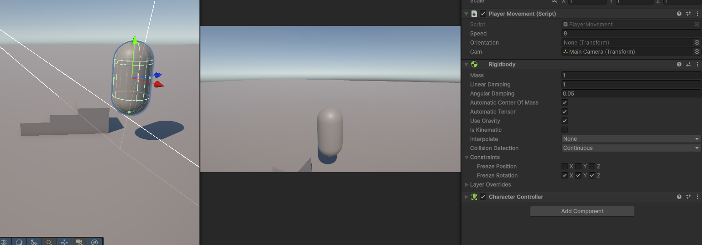
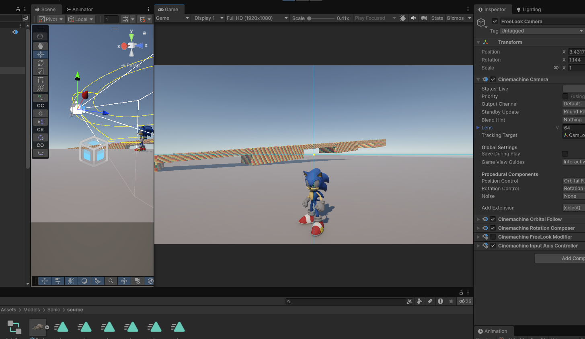
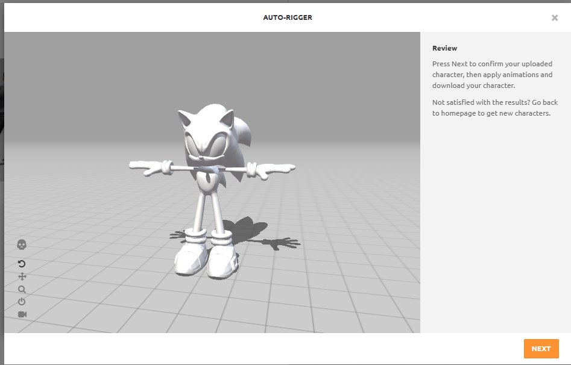
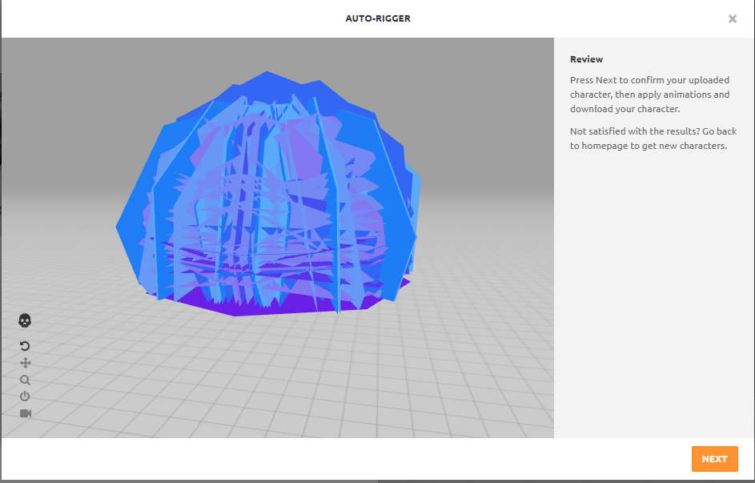
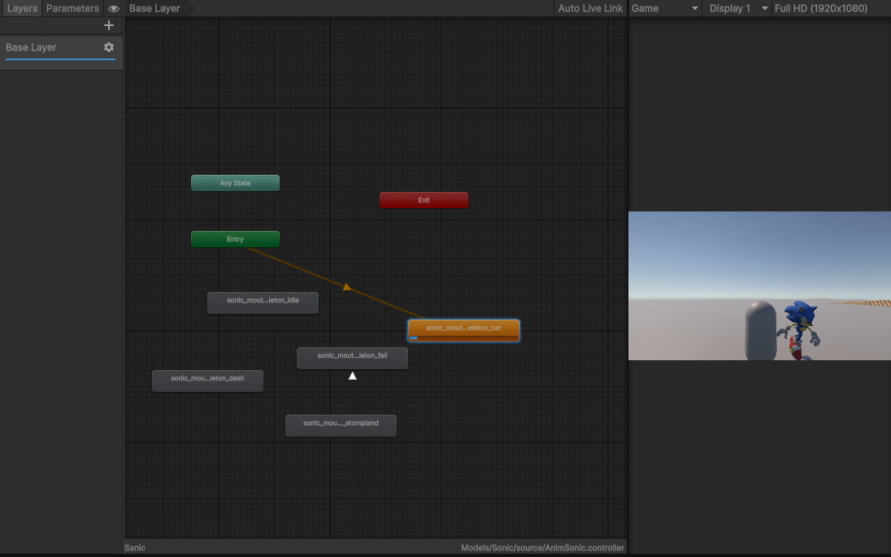
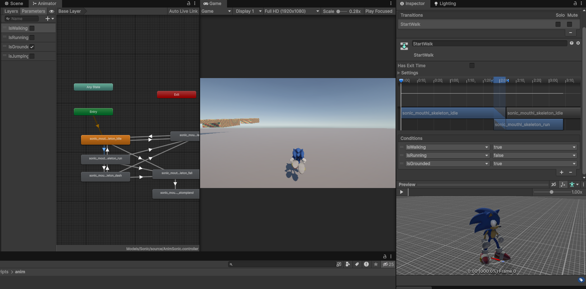
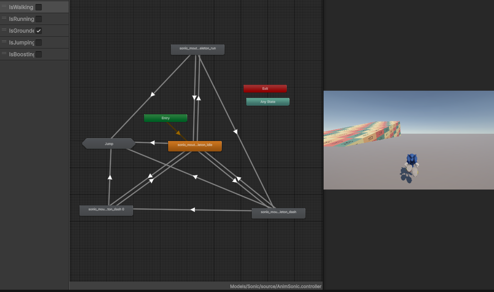
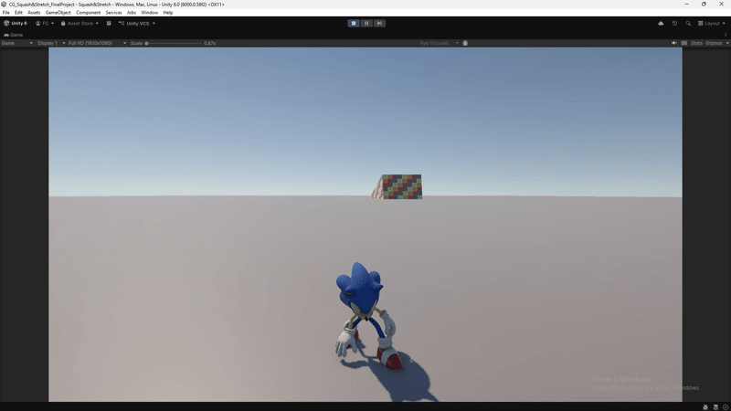
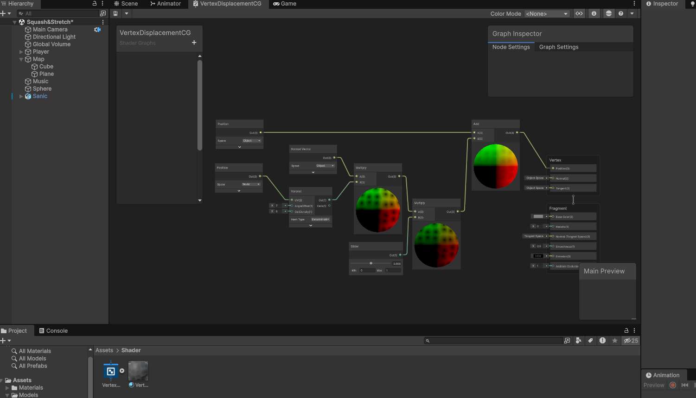
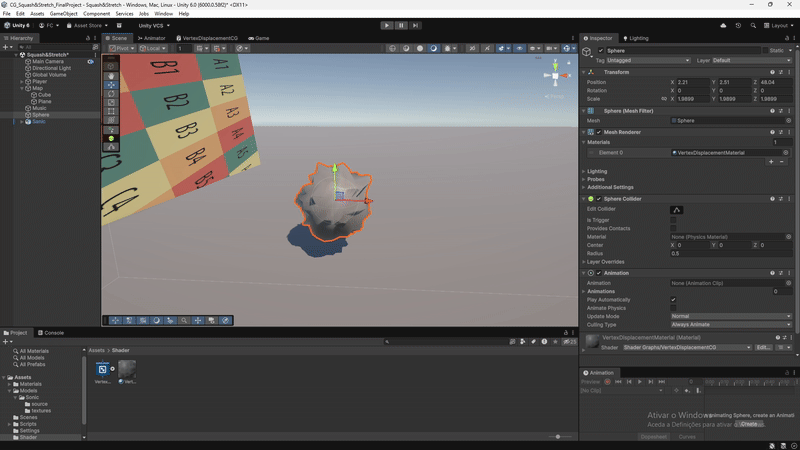

# Relatório
## Tema: Squash & Stretch
Comecei por pesquisar sobre oque o professor queria dizer com a parte de ter de focar em como usaria o Squash & Stretch na prática durante o jogo, comecei por pesquisar no google "What is Squash & Stretch" para me relembrar melhor sobre essa técnica em questões de Computação gráfica e após um breve resumo comecei por pesquisar "how can i use the Squash&Stretch technic in real time game" e só obtive resultados que não me ajudaram muito como tutorias de como fazer rig dos modelos 3d para fazer a técnica em blender, nada sobre como implementar em tempo real em gameplay no unity. Decidi então perguntar ao ChatGPT sobre este assunto e ele falou me de alguns pontos como fazer a deformação da mesh baseando se na velocidade/acelaração do player e das colisões do player.

Após isso eu comecei a pensar como poderia fazer isso em questões de projeto e tive a idea de fazer um jogo igual ao sonic com o modelo do personagem onde quando salto o personagem esticaria e quando caio ele espalmava, e quando ele acelera a sua mesh ia esticando aos poucos. Comecei o projeto a ver tutoriais de como fazer um player controller parecido ao usado nos jogos do sonic.

---

### Player Controller e formação do personagem 
Com a minha idea já definida criei o projeto no unity e comecei por ver tutoriais e discussões online sobre "camera moviment" e "player moviment/controller" para fazer algo parecido ao estilo de jogo 3d do Sonic, comecei então por ver alguns tutorias no youtube sobre momentum e rigidbodys mas não encontrava nada que me podesse satisfazer então decidi procurar por discussões que me podessem ajudar com isto. 
Após algum tempo de pesquisa encontrei uma discussão sobre "Third Person Camera Movement Script" e decidi implementar esses scripts no meu projeto, tive de mudar algumas coisas no projeto como adicionar um "character controller", um "rigidbody"(eu decidi dar lock na rotation nos eixos x y e z para a mesh do "player" não ficar a cair ou a rebolar ou a dar cambalhotas), e um "capsule collider" adicionei tambem uma "capsule mesh" para ver o que acontecei ao "player", tive de criar dois scripts estes sendo *PlayerMovement.cs* para o movimento do "player", *PlayerCam* para a "Main camera" movimentar-se com o "player", criei tambem um "empty object" com o proposito de server como tag para o "LookAt" da "MainCamera", consegui o resultado que queria embora ainda falta-se emplementar um script de salto e um para fazer o "player" acelarar aos poucos e tambem ainda queria implementar algo que deixasse a camera girar com o rato mas sempre a olhar para o jogador.

Para fazer isso instalei um package chamado Cinemachine, onde apos isso criei uma "camera free look" dentro do player e fiz com que desse "tracking target" no objeto "lookatcam" para ficar sempre a mirar no jogador e fiz a orbita da camera mais baixa para parecer mais "Third person" do que "Top down", de seguida decidi ver alguns tutorias para fazer o jogador saltar e aumentar a velociade a medida que vai correndo. Comecei por mudar o script do "PlayerMovement" adicionando algo para fazer a orientação do player para a mesh virar na direçao em que o jogador anda, fiz tambem com que o cursor fica-se "locked" na tela e que fica-se invisivel. Antes de ter começado a fazer o codigo de salto do player deparei-me com um erro onde o player subia obstaculos mas nunca cai, mesmo se saisse do mapa ele nunca caia, eu pensei que era erro da gravidade mas ela estava ligada, após pesquisar sobre o assunto vi que se eu tiver um "rigidbody" e um "character controller" no mesmo objeto, aquilo da erros pois o character controller não respeita os termos do rigidbody supostamente, então tive que remover o character controller e fazer um script de movimento com os keybinds do zero para que funciona-se. 

Deparei me com algumas dificuldades tendo de ver outros tutoriais de movimento, tendo problemas com a rotaçao do player ou até mesmo a direção que o player olhava quando clicava nas "Keybinds" usei um pouco da ajuda do ChatGPT para este problema pois uma das coisas que acontece várias vezes quando se usa diferentes tutorias para um script é que fica tudo confuso e baralhado então tive que pedir a ajuda do chat para me ajudar a perceber as partes que me estavam confusas e erros no codigo para que funcionasse tudo como eu queria. Apos isso adicionei uma rampa no jogo e pus o "rigidbody" do jogador para "Interpolate" e o "Collision Detection" para "Continuos". Agora que, estava tudo bem com a base do movimento decidi avançar para o salto do jogador, comecei por adicionar variaveis como "jumpForce" e "jumpCooldown", decidi tambem seguir o tutorial e adicionar uma variavel "airMultiplier" e um bool "readyToJump" para so poder saltar quando o jogador tiver grounded. Tive alguns problemas denovo com o jump mas consegui resolver pois tinha reparado que tinha posto a massa do jogador a 50 e por isso é que ele não saltava. 

De seguida tive outro problema com o facto do jogador quando estava nas escadas se ele ficasse no ar preso entre as escadas, o jogador nao se movia, ele ficava parado sempre como se tivesse em a saltar infinitamente, logo tive de tentar fazer algo com que o jogador conseguise mover o personagem nem que seja para os lados para ver se conseguia resolver esse problema, percebi que o meu "else" no "Move Player" estava a usar "AddForce" e isso não me deixava mexer equanto estava no ar, logo decide usar o mesmo que usei no "if" mas inves de multiplicar a direção com o "Speed" decidi multiplicar com o "airMultiplier". 

Quando pensei que o tinha resolvido deparei me com outro erro, o jogador pode esta a correr com o maximo de velocidade definido mas se ele salta parece que perde toda a velocidade, logo tive que mudar o "if" do "MovePlayer" onde adicionei um calculo para fazer a mudança de velocidade certa quando o jogador salta para não parecer que ele perdeu o "momentum" todo. Após isto comecei a fazer algo para o "player" poder acelarar aos poucos, vendo outra discussão no "unity forum" para o mesmo, para depois sim começar a fazer em tempo real o "Squash and Stretch effect", onde eu fazia o "Current Speed", o "Max Speed", a "Acceleration" e a "Deceleration". O jogador começava com o "current speed" a 0 onde o valor da acelaração era 5, subindo de 5 em 5 até chegar ao valor maximo ja posto no "Max Speed" que seria 30, quando parasse para o valor do "current speed" não ficar sempre no valor que o jogador ficou antes de parar de andar, o valor "Deceleration" serve para baixar o current speed após ele tenha sido usado quando se anda logo com o valor de "35" ele baixa todo em menos de um segundo para o valor de 0.

#### Camera and Rigidbody Tests

  
  

##### Links
Link do video_1:(https://youtu.be/f473C43s8nE?si=ktjmunguElpnP7We)

Link do video_2:(https://www.youtube.com/watch?v=xCxSjgYTw9c)

Link da Discussão_1:(https://discussions.unity.com/t/third-person-camera-movement-script/783511)

Link da Discussão_2:(https://discussions.unity.com/t/question-how-to-gradually-increase-speed-of-movement/451165/8)

Após criar as bases do playerMovement, abri o site Sketchfab e comecei por procurar modelos 3d do Sonic, apos encontrar um em T-pose dei download e decidi testa-lo ao colocar ele no mixamo para ter animaçoes dele a correr a saltar e a cair, até que o personagem quando selecionava uma animação ficava horas a carregar, mesmo dando refresh então decidi ir as opções ver se havia algo de errado quando deparei me que o esqueleto dele estava todo destruido, parecia uma bola toda deformada, decidi então desistir dessa idea de usar o mixamo e fui procurar então modelos no Sketchfab que trouxessem animações já implementadas, de preferencia de correr saltar e cair. Após ter encontrado pus ela no projeto e comecei por criar um animator controller no prefab da mesh do Sonic com as animações, pondo tbm ele na hierarquia do projeto substituindo com a mesh da capsula. 

Dupliquei as animações que queria usar no projeto e adicionei as ao animator, após isso comecei a ver diferentes tutorias de como implementar as animações das meshes 3d no Unity com o animator, com bools e com scrits, tendo então de criar um script ´AnimateStateController` com o proposito de fazer com que os bools ativassem quando o jogador salta-se ou se move-se pelo mapa, usando bools como "IsWalking", "IsRunning", "IsGrounded", "Is Jumping" e tendo de criar um "sub-state machine" pela primeira vez para as animações de jump, tive vários problemas durante o desenvolvimento, tendo de ver diferentes tutoriais e perguntar ao chatGPT para ver se ele encontrava certos erros que eu não encontrava no projeto sendo um deles, eu ter posto o "Rigidbody" invês de por para ver o "RigidbodyInParent" pois o meu rigidbody esta no "EmptyObject" Player e não na mesh do Sonic logo estava a dar esse erro que eu não me tinha apercebido por um bom periodo de tempo. 

Após aprender mais sobre o animator deparei me que o jogador apos cair no chão fica-va estranho mover sem ter uma pausa, logo decidi implementar um "delay" para o mesmo pondo um "float" que servia como "timer" para desativar e ativar o "input" do jogador, logo quando o jogador fica com o "Ground True" ele desativa o "input" por esse tempo definido, eu pus esse tempo coicidir com o tempo da animação do personagem levantar-se depois de cair.

#### Mixamo Test

  
  

#### Animator

  
  
  

#### Final Result

##### Links
Link do primeiro modelo:(https://sketchfab.com/3d-models/xbox-360-sonic-unleashed-sonic-the-hedgehog-1f316aaee4154864b465de7b879fed53)

Link do Segundo modelo:(https://sketchfab.com/3d-models/sonic-forces-sonic-rig-e5bc3ffc419b4d8ca5318a2d3255c48d)

Link do Tutorial1:(https://www.youtube.com/watch?v=vApG8aYD5aI&list=PLwyUzJb_FNeTQwyGujWRLqnfKpV-cj-eO&index=3)

Link do Tutorial2:(https://www.youtube.com/watch?v=_ob8hgtHHrE)

---
### Inicio da produção do Squash & Stretch Effect em tempo real

Após ter feito uma base já sólida, comecei por pensar em como faria a "mesh" do jogador fazer os efeitos não por animações em "blender" mas sim por código em unity que acontece-se em tempo real no jogo. Pensei se poderia usar um "shader" que fizesse o personagem parecer gelatina quando pussese o "shader" nele, ou mesmo tentar replicar a técnica de colliders "mesh" deforming, não fazia ideia por onde começar e como o deveria fazer, decide então começar por procurar na net sobre o assunto encontrando três formas diferentes, uma sendo por código "Monobehaviour", usando o "Transform" da "mesh" para fazer os efeitos Squash & Stretch, outra forma é fazer um "ShaderGraph Vertex Displacement", que serveria para mudar os vertices da "mesh" e fazer o efeito que queremos, e outro era tentar replicar em objetos usando "mesh" deforming com codigo "MonoBehaviour". Eu também percebi que as diferentes técnicas têm diferentes limitações, como por exempo no caso de mudar usando o "Transform" com código "monobehaviour" mudaria as colisões da "mesh" também, achei que isso não seria bom para uma "mesh" que servia como player e mexe-se, seria mais para objetos parados, já o "ShaderGraph" deforma a "mesh" só a nivel visual, e não afeta o sistem de colisões nem a as fisicas da "mesh" logo serviria melhor para usar no personagem.

Optei por começar a experimentar a opção do "ShaderGraph", começando por criar um "ShaderGraph URP Lit" e comecei a ver um documento sobre "ShaderGraph Vertex Displacement", para perceber melhor como funcionaria o sistema. Pelo que percebi do documento esta técnica consiste em modificar a posição dos vértices da "mesh" diretamente no "vertex shader", permitindo alterar a forma do objeto em tempo real, como o professor tinha pedido, sem recorrer a animações já feitas ou à modificação do "Transform" do objeto. No "Shader Graph" adicionei nodes de posição que servem para obter a posição original de cada vértice em "Object" e no mundo em "World", após isso usei algo que nunca tinha usado chamado de "Voronoi" que pelo que percebi dele, ele serve para usar a posição dos vértices como entrada, para de alguma forma gerar um padrão de ruído procedural com isso. De seguida adiconei o "node" "Normal Vector" pondo a opção "Object" que serve para garantir que o deslocamento ocorre ao longo da normal da superfície, preservando a forma geral do objeto, depois multipliquei o "Voronoi" com o "Normal Vector" para definir a direção e intensidade do deslocamento. Para permitir o controlo dinâmico da força do deslocamento diretamente no material tive que adicionar um "Slider" que multipliquei com o "Voronoi * NormalVecto" e por fim somei esta ultima multiplicação com a posição do objeto. Quando criava um material com esse shader e ponha numa "mesh" como uma esfera. 

#### Shader First Test Results

  
  

Após isto tive que pensar como poderia agora utilizar isto para fazer o Shader Squash&Stretch. Fiz um ideia base para o shader onde
